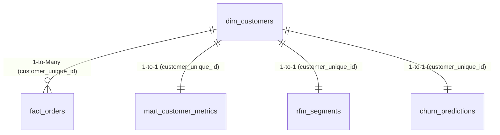

# Microsoft Power BI DirectQuery Setup Guide

This operational guide details how to connect **Microsoft Power BI** directly to the Mercury customer intelligence warehouse on **Neon PostgreSQL**, establish dimensional relationships, and implement business DAX measures.

---

## 1. Connection Configuration

Mercury uses PostgreSQL schemas hosted on Neon serverless PostgreSQL. Power BI supports both **DirectQuery** and **Import** data connectivity modes.

### Recommended Connectivity Modes
- **DirectQuery Mode (Recommended for Operational Dashboards)**: Queries pass directly through to PostgreSQL in real-time. No local data caching in Power BI, guaranteeing that retention queues and churn probabilities reflect the latest ML inference runs immediately.
- **Import Mode (Recommended for Ad-hoc Historical Slicing)**: Ingests a snapshot into Power BI VertiPaq memory engine for ultra-fast multi-dimensional slicing.

### Connection Parameters
1. Open **Power BI Desktop** -> **Get Data** -> **PostgreSQL database**.
2. Enter the connection settings:
   - **Server**: `<neon_host>` (e.g. `ep-cool-fog-123456-pooler.us-east-2.aws.neon.tech`)
     > [!TIP]
     > Always use Neon's **pooled connection string** (containing `-pooler`) to prevent exhausting PostgreSQL connection limits when DirectQuery issues concurrent visual queries.
   - **Database**: `mercury`
   - **Data Connectivity mode**: Select **DirectQuery** (or **Import**).
3. Under **Authentication**:
   - Select **Database**.
   - **User name**: `<neon_user>`
   - **Password**: `<neon_password>`
   - **Encryption**: Verify SSL is enabled (`sslmode=require` is enforced by Neon).

---

## 2. Table Selection & Schema Boundaries

When prompted by the Power BI Navigator, select the dimensional marts and machine learning inference tables:

| Schema | Table | Description | Role in Star-Schema |
|:---|:---|:---|:---|
| `mart` | `fact_orders` | Grain: 1 row per delivered order (amounts, dates, review score, delays) | **Central Fact Table** |
| `mart` | `dim_customers` | Grain: 1 row per unique customer (location, first/last order, tenure) | **Customer Dimension** |
| `mart` | `mart_customer_metrics` | Grain: 1 row per unique customer (RFM raw metrics, friction, sentiment) | **Customer Analytics Dimension** |
| `ml` | `rfm_segments` | Grain: 1 row per unique customer (R/F/M quintile scores, segment name) | **Segmentation Dimension** |
| `ml` | `churn_predictions` | Grain: 1 row per unique customer (churn probability, risk tier, revenue at risk) | **Predictive Intelligence Dimension** |

---

## 3. Dimensional Data Model & Relationships

Navigate to the **Model view** in Power BI and configure the following table relationships:



### Relationship Cardinality & Cross-Filter Direction

1. **`mart.dim_customers` -> `mart.fact_orders`**:
   - **From Column**: `dim_customers[customer_unique_id]`
   - **To Column**: `fact_orders[customer_unique_id]`
   - **Cardinality**: `1 to Many (1:*)`
   - **Cross-filter direction**: `Single`

2. **`mart.dim_customers` -> `mart.mart_customer_metrics`**:
   - **From Column**: `dim_customers[customer_unique_id]`
   - **To Column**: `mart_customer_metrics[customer_unique_id]`
   - **Cardinality**: `1 to 1 (1:1)`
   - **Cross-filter direction**: `Both`

3. **`mart.dim_customers` -> `ml.rfm_segments`**:
   - **From Column**: `dim_customers[customer_unique_id]`
   - **To Column**: `rfm_segments[customer_unique_id]`
   - **Cardinality**: `1 to 1 (1:1)`
   - **Cross-filter direction**: `Both`

4. **`mart.dim_customers` -> `ml.churn_predictions`**:
   - **From Column**: `dim_customers[customer_unique_id]`
   - **To Column**: `churn_predictions[customer_unique_id]`
   - **Cardinality**: `1 to 1 (1:1)`
   - **Cross-filter direction**: `Both`

---

## 4. Production DAX Measures Reference

Create a dedicated measure table `_Measures` in Power BI and implement the following standard portfolio metrics:

### 4.1 Financial & Transaction Volume Measures
```dax
// Gross Merchandise Value (GMV)
Total GMV = 
SUM(fact_orders[total_amount])

// Completed Order Count
Total Orders = 
COUNTROWS(fact_orders)

// Average Order Value (AOV)
Average Order Value = 
DIVIDE([Total GMV], [Total Orders], 0)

// Total Freight Charges
Total Freight = 
SUM(fact_orders[freight_amount])
```

### 4.2 Customer Retention & Cohort Measures
```dax
// Total Distinct Customers
Total Customers = 
DISTINCTCOUNT(dim_customers[customer_unique_id])

// Multi-Order Repeat Customers
Repeat Customers = 
CALCULATE(
    DISTINCTCOUNT(dim_customers[customer_unique_id]),
    dim_customers[lifetime_orders] > 1
)

// Portfolio Repeat Purchase Rate (%)
Repeat Purchase Rate = 
DIVIDE([Repeat Customers], [Total Customers], 0)
```

### 4.3 Machine Learning & Revenue-at-Risk Measures
```dax
// Total Portfolio Revenue at Risk
Portfolio Revenue at Risk = 
SUM(churn_predictions[revenue_at_risk])

// Priority 1 VIP Retention Exposure (High-Value Customers in Danger)
VIP Revenue at Risk = 
CALCULATE(
    SUM(churn_predictions[revenue_at_risk]),
    churn_predictions[retention_priority] = "Priority 1 (VIP Retention)"
)

// High Churn Risk Customer Count (P >= 0.70)
High Risk Customer Count = 
CALCULATE(
    COUNTROWS(churn_predictions),
    churn_predictions[risk_tier] = "High"
)

// High Risk Customer Share (%)
High Risk Customer % = 
DIVIDE([High Risk Customer Count], [Total Customers], 0)

// Mean Portfolio Churn Probability
Average Churn Probability = 
AVERAGE(churn_predictions[churn_probability])
```

### 4.4 Fulfillment Friction & Quality Scorecard
```dax
// Late Delivery Orders Count
Late Orders Count = 
CALCULATE(
    COUNTROWS(fact_orders),
    fact_orders[is_late_delivery] = TRUE()
)

// Late Delivery Rate (%)
Late Delivery Rate = 
DIVIDE([Late Orders Count], [Total Orders], 0)

// Average Customer Review Score (1.0 to 5.0)
Average Review Rating = 
AVERAGE(fact_orders[review_score])

// Negative Sentiment Share (Review Rating <= 2)
Negative Review Share = 
DIVIDE(
    CALCULATE(COUNTROWS(fact_orders), fact_orders[review_score] <= 2),
    [Total Orders],
    0
)
```

---

## 5. Recommended Visual Layouts

| Report Page | Visual Type | Primary Measures / Dimensions | Business Purpose |
|:---|:---|:---|:---|
| **Executive Overview** | KPI Cards & Trend Chart | `Total GMV`, `Total Orders`, `AOV`, `Repeat Purchase Rate`, `Portfolio Revenue at Risk` | High-level portfolio health scorecard |
| **RFM Segmentation** | Treemap & Scatter Plot | `dim_customers` segmented by `rfm_segments[segment_name]`, X: `recency_days`, Y: `lifetime_spend` | Distribution of Champions, Loyal, At Risk, Lost |
| **Retention Command** | Matrix & Slicers | `churn_predictions[retention_priority]`, `churn_predictions[risk_tier]`, `VIP Revenue at Risk` | CRM action queue prioritization |
| **Fulfillment Quality** | Bar Chart by State | `Late Delivery Rate`, `Average Delay Days`, `dim_customers[customer_state]` | Logistic delay correlation with churn |

---

## 6. Scheduled Refresh & Gateway Configuration

- **Power BI Service Refresh**:
  - Because Neon is a cloud-hosted PostgreSQL endpoint with a public SSL interface, **no On-Premises Data Gateway is required** when publishing to the Power BI Service.
  - In Power BI Service dataset settings, configure **Cloud Data Source Credentials** using **OAuth2** or **Basic** (Database user/password) with **Encryption set to Encrypted (SSL)**.
- **Refresh Frequency**:
  - For DirectQuery reports, visual queries execute directly on demand.
  - For Import mode, schedule daily refreshes following nightly dbt transformations and ML model scoring runs (`02:00 UTC`).
